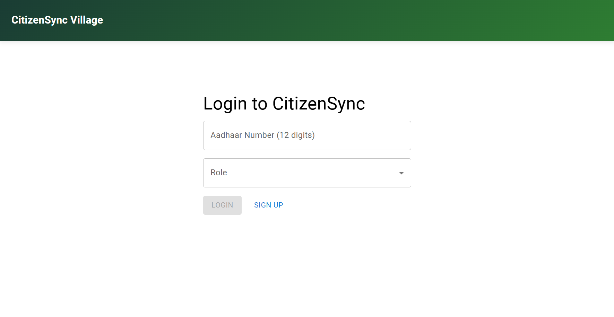
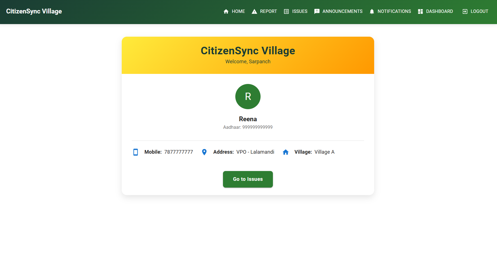

# CitizenSync Village

**CitizenSync Village** is a rural governance platform developed for **Code for Bharat**, designed to empower **Villagers**, **Sarpanch**, and **Tehsil Officers** to collaborate effectively on issue resolution, announcements, and community engagement.

🔗 **Live Demo**: [https://citizensync-village.web.app](https://citizensync-village.web.app)  
> _Note: If the app isn't working due to permissions, follow the local setup instructions below._

---

## 👥 Team Details

- **Team Name**: Hacktivate
- **Team Members**: Saurav and Vaishnavi Matsagar
- **Hackathon**: Code for Bharat Season 2

---

## 🚀 Features

### 🔐 Role-Based Access

| Role            | Features                                                                 |
|-----------------|--------------------------------------------------------------------------|
| **Villager**     | Report issues, vote on urgency, give satisfaction feedback, view announcements |
| **Sarpanch**     | Manage village-level issues, mark them solved, post announcements       |
| **Tehsil Officer** | Oversee escalated issues unresolved by Sarpanch for 5+ days             |

---

### 🛠️ Issue Management

- Report issues with descriptions, locations, and urgency.
- Villagers can vote on whether an issue is **urgent**.
- If unresolved for **5 days**, the issue escalates to the **Tehsil Officer**.
- After resolution, villagers vote on satisfaction.
- Low satisfaction triggers alerts for re-evaluation by the **Sarpanch**.

---

### 📢 Announcements

- Sarpanch can post important announcements visible to all villagers.

---

### 🔔 Notifications

- Real-time alerts for:
  - Issue updates
  - Escalations
  - Satisfaction voting results

---

### 📊 Analytics

- Role-based dashboards showing:
  - Open & resolved issues
  - Most urgent/voted issues
  - Satisfaction trends

---

## 🧰 Tech Stack

| Layer            | Technology                  |
|------------------|-----------------------------|
| **Frontend**      | React, Material-UI           |
| **Backend**       | Firebase Firestore           |
| **Authentication**| Firebase Authentication (Anonymous sign-in for demo) |
| **Hosting**       | Firebase Hosting             |
| **Build Tool**    | Vite                         |

---

## 📁 Project Structure

```
citizensync-village/
├── public/
│   ├── index.html
│   ├── favicon.ico
├── src/
│   ├── App.jsx
│   ├── App.css
│   ├── main.jsx
│   ├── index.css
│   ├── i18n.js
│   ├── assets/
│   │   └── react.svg
│   ├── components/
│   │   ├── Comment.jsx
│   │   ├── IssueCard.jsx
│   │   ├── Navbar.jsx
│   │   └── VillageSelector.jsx
│   ├── pages/
│   │   ├── Announcements.jsx
│   │   ├── Dashboard.jsx
│   │   ├── Home.jsx
│   │   ├── IssuesList.jsx
│   │   ├── Login.jsx
│   │   ├── Notifications.jsx
│   │   ├── ReportIssue.jsx
│   │   └── VillageSelector.jsx
│   ├── services/
│   │   ├── api.js
│   │   └── firebase.js
│   ├── utils/
│   │   └── aiUtils.js
├── .firebaserc
├── firebase.json
├── firestore.rules
├── firestore.indexes.json
├── firestore-debug.log
├── .gitignore
├── eslint.config.js
├── package.json
├── vite.config.js
├── README.md
├── screenshots/
│   ├── login.png
│   └── dashboard.png
```

---

## 🖥️ Local Setup Instructions

### 1. Clone the Repository

```bash
git clone https://github.com/your-username/citizensync-village.git
cd citizensync-village
```

### 2. Install Dependencies

```bash
npm install
```

## 🔥 Firebase Setup

Follow these steps to configure Firebase for your project:

1. **Go to the Firebase Console**  
   Visit [https://console.firebase.google.com](https://console.firebase.google.com) and create a new Firebase project.

2. **Create a Web App**  
   Inside your Firebase project dashboard, click **Add App > Web App**, give it a name, and click **Register App**.

3. **Enable Firestore and Authentication**
   - Go to **Build > Firestore Database** and create a Firestore database.
   - Go to **Build > Authentication > Sign-in method**, and enable **Anonymous sign-in** (for demo/testing purposes).

4. **Get Firebase Config**
   - Navigate to **Project Settings > General > Your Apps > Firebase SDK snippet**.
   - Copy the configuration object that looks like this:

     ```js
     const firebaseConfig = {
       apiKey: "",              // Unique API key for your Firebase project
       authDomain: "",          // Auth domain used for authentication
       projectId: "",           // Project ID of your Firebase project
       storageBucket: "",       // Cloud Storage bucket for file uploads
       messagingSenderId: "",   // Sender ID used for push notifications (optional)
       appId: "",               // Unique identifier for your web app
       measurementId: ""        // Used for Google Analytics (optional)
     };
     ```

5. **Paste Config into Your Project**
   - Open `src/services/firebase.js`.
   - Replace the existing `firebaseConfig` object with the one you just copied.

### 4. Start Firebase Emulator (Optional)

```bash
npm install -g firebase-tools
firebase emulators:start
```

> The emulator runs:
> - Firestore at `localhost:8080`
> - Authentication at `localhost:9099`

### 5. Run the App

```bash
npm install
npm run dev
```

> Visit `http://localhost:5173` (check terminal output for the actual port).

---

## 🧪 Testing the App

1. Sign up using a test Aadhaar number (e.g., `123456789012`).
2. Choose a role: **Villager**, **Sarpanch**, or **Tehsil Officer**.
3. Complete the form with sample village and name.
4. Log in using the same Aadhaar and role to view your dashboard.

---

## 🔒 Security Notes

- **Authentication**: Anonymous Firebase Auth is used for demo purposes. Aadhaar-based verification should use custom token auth via a secure backend.
- **Access Control**: Firestore security rules enforce:
  - Users can read/write only their own data.
  - Only authenticated users can create/read issues.
  - Role-specific permissions for issue status updates and announcements.

---

## 📸 Screenshots
| Login Screen         | Dashboard View        |
|----------------------|-----------------------|
|  |  |

---

